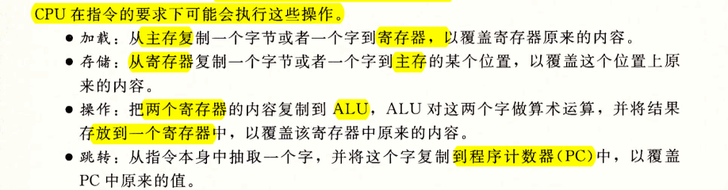
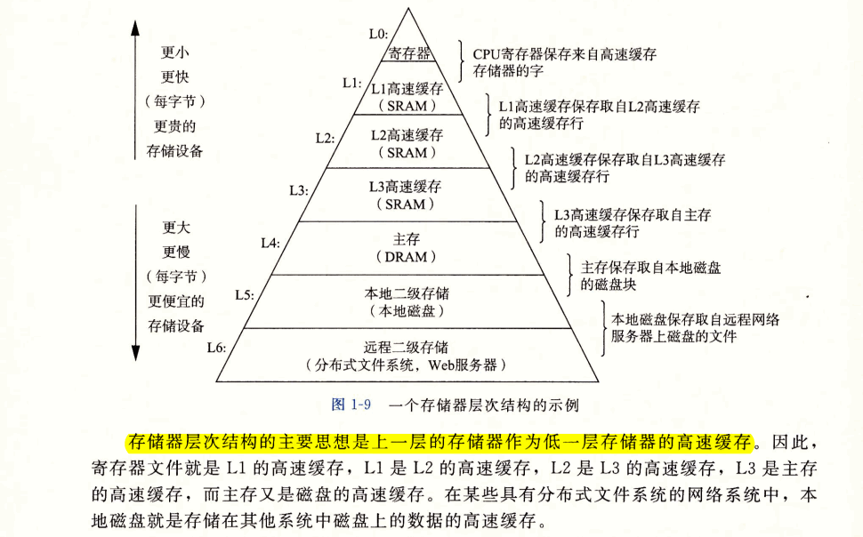

# Ch01 计算机系统漫游

- 本书的目的是帮助你了解当你的系统上执行hello程序时，系统发生了什么以及为什么会这样。

## 1.1 信息就是位+上下文
- 系统中所有的信息——包括磁盘文件、内存中的程序、内存中存放的用户数据以及网络上传送的数据，都是由一串比特表示的。区分不同数据对象的唯一方法是我们读到这些数据对象时的上下文

## 1.2 程序被其它程序翻译成不同的格式

## 1.3 了解编译系统如何工作是大有益处的

- 程序员必须知道编译系统如何工作的原因：
  - 优化程序性能 -> Chapter3，5，6
  - 理解链接时出现的错误 -> Chapter7
  - 避免安全漏洞 -> Chapter3

#### Question
- 优化程序性能：-> Chapter3，5，6,
  - q1.1 一个switch语句是否总是比一系列的if-else语句高效得多？
  - q1.2 一个函数调用的开销有多大？
  - q1.3 while循环比for循环更有效吗？
  - q1.4 指针引用比数组索引更有效吗？
  - q1.5 为什么将循环求和的结果放到一个本地变量中，会比将其放到一个通过引用传递过来的参数中，运行起来快很多呢？
  - q1.6 为什么我们只是简单地重新排列一个算术表达式中的括号就能让函数运行得更快？
- 理解链接时出现的错误 -> Chapter7
  - q1.7 链接器报告说它无法解析一个引用，这是什么意思？
  - q1.8 静态变量和全局变量区别是什么？
  - q1.9 如果你在不同的C文件中定义了名字相同的两个全局变量会发生什么？
  - q1.11 静态库和动态库的区别是什么？
  - q1.12 我们在命令行上排列库的顺序有什么影响？
  - q1.13 为什么有些链接错误直到运行时才会出现？

## 1.4 处理器读并解释储存在内存中的指令

- 为了理解运行hello程序时发生了什么，需要了解一个典型系统的硬件组织，如图1-4所示

### 1.4.1 系统的硬件组成
- 总线：贯穿整个系统的一组电子管道，称作总线。它携带信息字节并负责在各个部件间传递。总线通常被设计成传送定长的字节块，也就是字
- I/O设备：系统与外部世界的联系通道。
- 主存：主存是一个临时存储设备，在处理器执行程序时，用来存放程序和程序处理的数据。
- 处理器：CPU，是解释（或执行）存储在主存中指令的引擎。CPU的核心是一个大小为一个字的存储设备（或寄存器），称为程序计数器（PC）

  

  - 从系统通电开始，知道系统断电，处理器一直在不断地执行程序计数器指向的指令，再更新程序计数器，使其指向下一条指令。
  - 指令集架构描述每条机器代码指令的效果；
  - 微体系结构描述处理器实际上如何实现。

### 1.4.2 运行hello程序

## 1.5 高速缓存至关重要
- 磁盘读取一个字的时间开销要比主存中读取的开销大1000万倍
- 处理器从寄存器文件中读数据比从主存读取几乎快100倍
- 针对处理器（寄存器读写可在一个时钟内完成）和主存之间的差异，系统设计者在两者之间采用了更小更快的存储设备：高速缓存存储器（cache或高速缓存），存放处理器近期可能会需要的信息。
- 高速缓存使用静态随机访问存储器(SRAM)的硬件技术实现。
- 意识到高速缓存存储器存在的应用程序员能够利用高速缓存将程序的性能提高一个数量级。

## 1.6 存储设备形成层次结构

## 1.7 操作系统管理硬件

- 操作系统有两个基本功能：
  - 防止硬件被失控的应用程序滥用
  - 向应用程序提供简单一致的机制来控制复杂而又通常大不相同的低级硬件设备
- 操作系统通过几个基本抽象概念来实现这两个功能
  - 文件：对I/O设备的抽象表示
  - 虚拟内存：对主存和磁盘I/O设备的抽象表示
  - 进程：对处理器、主存和I/O设备的抽象表示

### 1.7.1 进程

### 1.7.2 线程

- 一个进程实际上可以由多个称为线程的执行单元组成，每个线程都运行在进程的上下文中，并共享同样的代码和全局数据。
- 当有多处理器可用的时候，多线程也是一种使得程序可以运行得更快的方法。

### 1.7.3 虚拟内存

- 虚拟内存是一个抽象概念，它为每个进程提供一个假象，即每个进程都在独占地使用主存。每个进程看到的内存都是一致的，称为`虚拟地址空间`

- 虚拟内存的运作需要硬件和操作系统软件之间精密复杂的交互，包括对处理器生成的每个地址的硬件翻译。
  - 基本思想：把一个进程虚拟内存的内容存储在磁盘上，然后用主存作为磁盘的高速缓存。

### 1.7.4 文件

- 文件就是字节序列，仅此而已。

## 1.8 系统之间利用网络通信

- 从一个单独的系统来看，网络可视为一个I/O设备
  

## 1.9 重要主题

- 系统不仅仅只是硬件，系统是硬件和系统软件互相交织的集合体，必须共同协作以达到运行应用程序的最终目的。

下面介绍几个贯穿计算机系统所有方面的重要概念。

### 1.9.1 Amdahl定律

#### Exercise
- e1.1

    

  > A: 1.25x; B: 302

- e1.2

   

  > $k=2.67$

### 1.9.2 并发和并行

- 驱动计算机进步的两个动力
  - 一个是我们想要计算机**做的更多**
    - 我们用术语并发（concurrency）指一个同时具有多个活动的系统
  - 另一个是我们想要计算机**运行的更快**
    - 我们用术语并行（parallelism）指的是用并发来使一个系统运行得更快

并行可以在计算机系统多个抽象层次上运用，按照系统层次结构中由高到低的顺序重点强调单个层次：

#### 线程级并发
- 构建在**进程这个抽象**上，我们能够设计出同时有多个程序执行的系统，这就导致了并发。
- 出现时间片共享后，计算机系统有了并发的支持。传统意义上，并发执行时模拟出来的，通过使一台计算机在它正在执行的进程间快速切换来实现。
- 单处理器系统：一个处理器；
- 多处理器系统：由单OS内核控制的多处理器组成的系统

  

  - 随着多核处理器和超线程的出现，多处理器系统才变得常见。

- 多核处理器有多个CPU集到一个集成电路芯片上。

  

- 超线程：有时称为同时多线程(simulaneous multi-threading)，是一项允许一个CPU执行多个控制流的技术。

  

- 多处理器的使用可以从两方面提高系统性能
  - 首先，它减少了在执行多个任务时模拟并发的需要
  - 其次，它可以使应用程序运行的更快，当然，这必须要求程序是以多线程方式来书写的。
- 多核和超线程系统的出现极大地激发了一种愿望，即找到书写应用程序的方法利用硬件开发线程级并行性。

#### 指令级并行

- 指令级并行：在**较低抽象层次**上，现代处理器可以同时执行多条指令的属性。
  - 主要使用了流水线技术
- 超标量（super-scalar）：如果处理器可以达到比一个周期一条指令更快的运行效率，称为超标量。

#### 单指令、多数据并行
- 在**最低层次**上，许多现代处理器拥有特殊的硬件，允许一条指令产生多个可以并行执行的操作，这种方式称为单指令、多数据，即SIMD并行
  - 虽然有些编译器会试图从C程序中自动抽取SIMD并行性，但是**更可靠的方法是用编译器支持的特殊的向量数据类型**来写程序，比如GCC就支持向量数据类型。

### 1.9.3 计算机系统中抽象的重要性

## 1.10 小结

