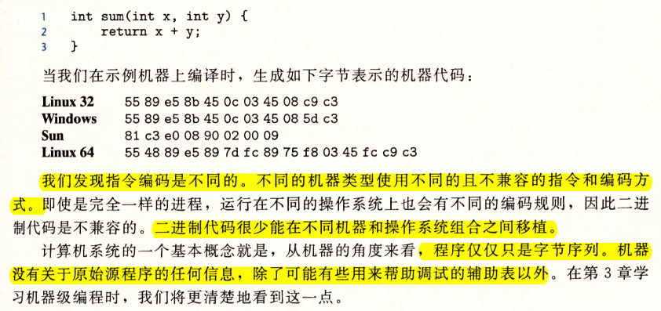
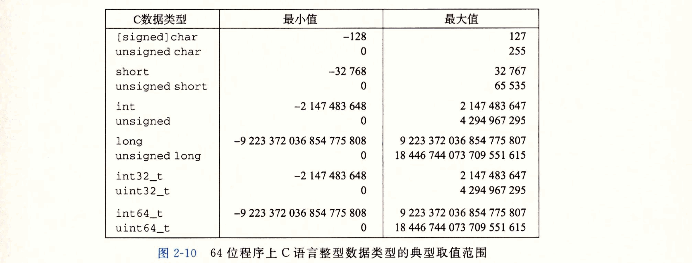
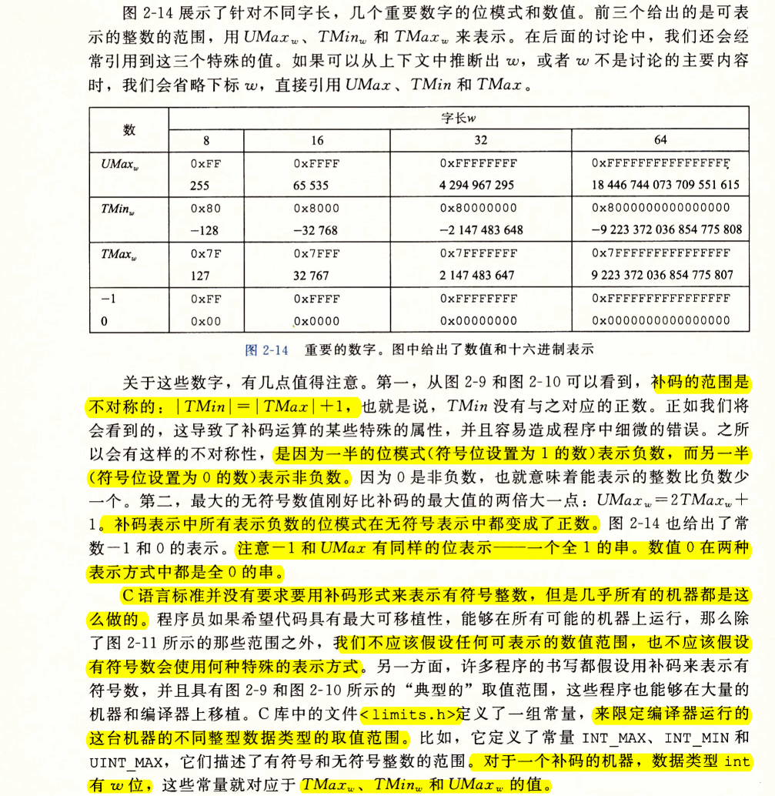
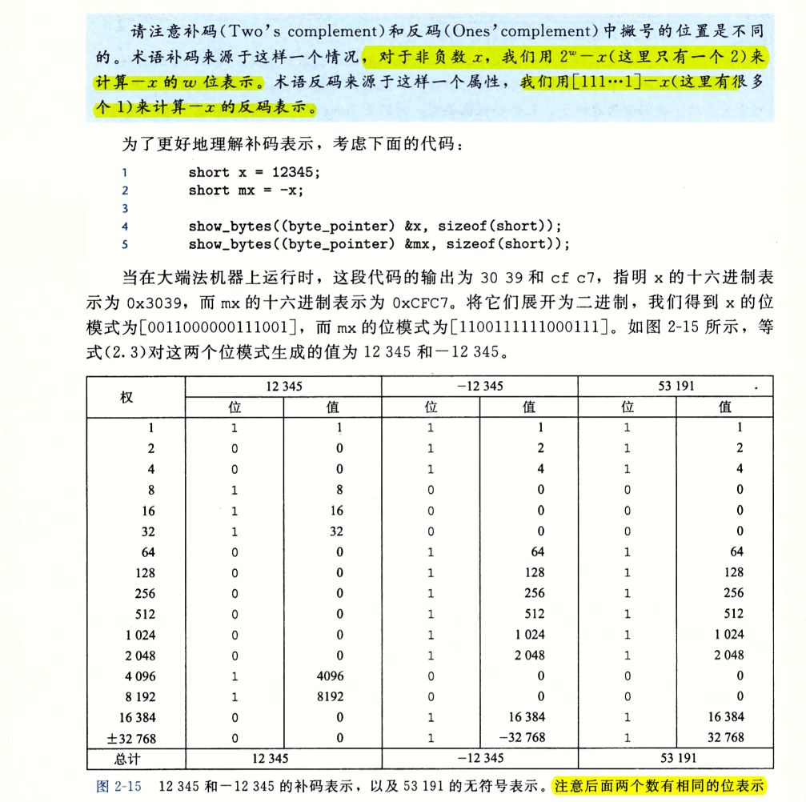
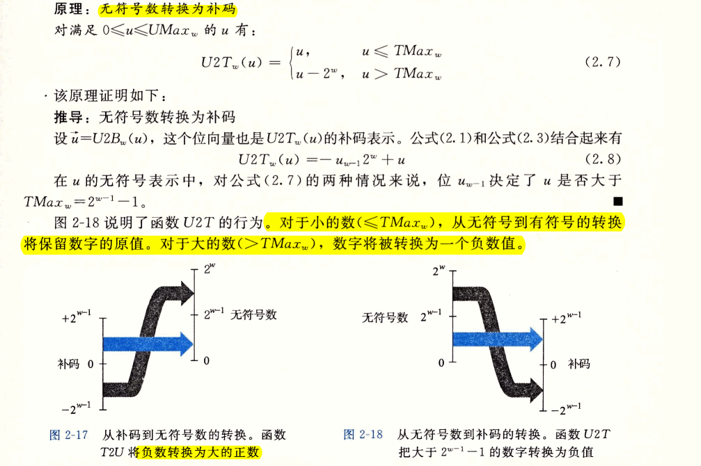
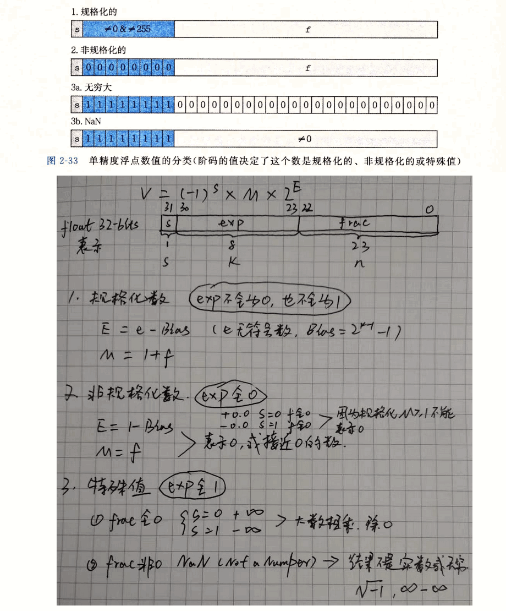

# Ch02 信息的表示和处理

- 孤立地讲，单个的位不是非常有用。然而，当把位组合在一起，再加上某种解释，即赋予不同的可能位模式以含义，就能够表示任何有限集合的元素。
- 我们研究三种最重要的数字表示：
  - 无符号编码：基于传统的二进制表示法，表示大于或者等于零的数字
  - 补码编码：表示有符号整数的最常见的方式，有符号整数就是可以为正或者负的数字
  - 浮点数编码：表示实数的科学计数法的以2为基数的版本。
- 计算机的表示法是用有限数量的位对一个数字编码，因此，当结果太大以至不能表示时，某些运算就会溢出。
  - 整数：计算一组正数的乘积可能产生一个负的结果；虽然，计算可能没有产生期望的结果，但是对这组乘积的计算，无论使用结合律和交换律，都会**结果一致**。

  

  - 浮点：浮点运算有完全不同的数学属性。虽然溢出会产生特殊的值$+\infty$，但是**一组正数的乘法总是正的**。由于表示的精度有限，**浮点运算是不可结合的**。

  $$
  (3.14+1e20)-1e20=0.0 \\
  3.14+(1e20-1e20)=3.14
  $$

- 整数运算和浮点数运算会有不同的数学属性是因为它们处理数字表示有限性的方式不同
  - 整数的表示虽然只能编码一个相对较小的整数范围，但是这种表示是精确的；
  - 浮点数虽然可以编码一个较大的数值范围，但是这种表示只是近似的。
  


## 2.1 信息存储
- 机器级程序将内存视为一个非常大的字节数组，称为`虚拟内存(virtual memoery)`。内存的每个字节都由一个唯一的数字来标识，称为它的`地址(address)`，所有可能地址的集成就称为`虚拟地址空间(virtual address space)`。
  - 这个虚拟地址空间只是一个展现给机器程序的概念性映像。实际的实现是将DRAM、闪存、磁盘存储器、特殊硬件和操作系统软件结合起来，为程序提供一个看上去统一的字节数组。
- 程序对象：程序数据、指令和控制信息。
- 编译器和运行时系统将存储器空间划分为更可管理得单元，来存放不同的程序对象。
  - 可以用各种机制来分配和管理不同部分的存储，这种管理完全是在虚拟地址空间里完成的。

### 2.1.1 十六进制表示法


### 2.1.2 字数据大小

- 每台计算机都有一个字长（word size），指明**指针**数据的标称大小(nominal size)。因为虚拟地址是以这样的字来编码的，所以字长决定的最重要的系统参数就是虚拟地址空间的最大大小。


- 可移植性的一个方面就是使程序对不同数据类型的确切大小不敏感。C语言标准对不同数据类型的数字范围设置了下界，但是却没有上界。当32/64位机器相互移植时就会发生错误，比如，许多程序员假设一个声明为int类型的程序对象能被用来存储一个指针。这在大多数32位机器上能正常工作，但是在一台64位的机器上会导致问题。

### 2.1.3 寻址和字节顺序

- 无论大端还是小端，一旦选择了特定操作系统，那么字节顺序也就固定下来。比如ARM支持大小端，但是这些芯片上最常见的两种操作系统——Android和IOS——却只能运行于小端模式。


- 使用sizeof而不是一个固定的值，是向编写在不同机器类型上可移植的代码迈进了一步。
  


```c
#include <stdio.h>

typedef unsigned char *byte_pointer;

void show_bytes(byte_pointer start, size_t len) {
    size_t i;
    for (i = 0; i < len; i++) {
        printf(" %.2x", start[i]);
    }
    printf("\n");
}

void show_int(int x) {
    show_bytes((byte_pointer) &x, sizeof(int));
}

void show_float(float x) {
    show_bytes((byte_pointer) &x, sizeof(float));
}

void show_pointer(void *x) {
    show_bytes((byte_pointer) &x, sizeof(void *));
}

void test_show_bytes(int val) {
    int ival = val;
    float fval = (float) ival;
    int *pval = &ival;
    show_int(ival);
    show_float(fval);
    show_pointer(pval);
}

int main() {
    test_show_bytes(12345);
    return 0;
}
```
```bash
dongkesi@DESKTOP-CL29DN1:/mnt/d/workspace/study/coa/CSAPP/code$ g++ e2-4.cc
dongkesi@DESKTOP-CL29DN1:/mnt/d/workspace/study/coa/CSAPP/code$ ./a.out
 39 30 00 00
 00 e4 40 46
 e8 a9 80 d8 ff 7f 00 00
```

### 2.1.4 表示字符串

- C语言中字符串被编码为一个以null(其值为0)字符结尾的字符数组。
- 在使用ASCII码作为字符码的任何系统上都将得到相同的结果，与字节顺序和字大小规则无关。因为，文本数据比二进制数据具有更强的平台独立性。
- Jave编程语言使用Unicode来表示字符串。对于C语言也有支持Unicode的程序库

### 2.1.5 表示代码



### 2.1.6 布尔代数简介

- 位向量就是固定长度为$w$、由0和1组成的串
  


### 2.1.7 C语言中的位级运算

- 表达式$~0$将生成一个全1的掩码，不管机器的字大小是多少。尽管对于一个32位机器来说，同样的掩码可以写成`0xFFFF FFFF`，但是这样的代码不是可移植的。

- e2.12
  ```c
  int main() {
    int x = 0x87654321;
    int a = x & 0xFF;
    int b = x ^ (~0xFF);
    int c = x | 0xFF;

    show_bytes((byte_pointer)&a, sizeof(a));
    show_bytes((byte_pointer)&b, sizeof(b));
    show_bytes((byte_pointer)&c, sizeof(c));
    return 0;
  }
  ```
### 2.1.8 C语言中的逻辑运算
- 逻辑运算认为所有非零的参数都表示TRUE，而参数0表示FALSE。它们返回1或者0，分别表示结果为TRUE或者为FALSE


- 逻辑运算符`&&`和`||`与它们对应的位级运算`&`和`|`之间的第二个重要区别是，如果第一个参数求值就能确定表达式的结果，那么逻辑运算符就不会对第二个参数求值。

### 2.1.9 C语言中的移位运算
- **C语言标准并没有明确定义对于有符号数应该使用哪种类型的右移——算术右移或者逻辑右移都可以**。不幸地，这意味着任何假设一种或者另一种右移形式的代码都可能会遇到可移植性问题。然而，实际上，**几乎所有编译器/机器组合都对有符号数使用算术右移**，且许多程序员也都假设机器会使用这种右移。另一方面，**对于无符号数，右移必须是逻辑的**。


## 2.2 整数表示


- 我们描述用位来编码整数的两种不同的方式：
  - 一种只能表示非负数
  - 另一种能够表示负数、零和正数

### 2.2.1 整型数据类型

- 唯一与机器相关的取值范围是大小指示符long。大多数64位机器使用8字节表示，32位机器使用4字节表示




- C语言标准定义了每种数据类型必须能够表示的最小的取值范围。如图2-11所示，它们的取值范围与图2-9和图2-10所示的典型实现一样或者小一些。


- C/C++都支持有符号（默认）和无符号数，JAVA只支持有符号数

### 2.2.2 无符号数的编码


### 2.2.3 补码编码







### 2.2.4 有符号和无符号之间的转换
- 将有符号强制类型转换为无符号数，或者反过来，会得到什么结果呢？
  - 从数学角度来看，对于在两种形式中都能表示的值，我们想保持不变。但是，将负数转换为无符号可能会得到0.如果转换的无符号数太大以至于超出了补码能够表示的范围，可能会得到$T_{Max}$。
  - 对于大多数C语言的实现来说，对这个问题的回答都是**从位级角度来看的，而不是数的角度**
  
    ```c
    #include <stdio.h>

    int main() {
        short int v = -12345;
        unsigned short uv = (unsigned short) v;
        printf("v = %d, uv = %u\n", v, uv);
        return 0;
    }
    //output
    v = -12345, uv = 53191
    ```
  - 以上代码看到，强制类型转换的结果保持位值不变，只是改变了解释这些位的方式。
  - 对于大多数C语言的实现，处理同样字长的有符号数和无符号数之间相互转换的一般规则是：数值可能会改变，但是位模式不变。




### 2.2.5 C语言中的有符号数与无符号数

- 通常大多数数字默认为是有符号的，如12345, 0x1A2B这样的常量，是有符号的。要创建一个无符号常量，必须加上后缀字符‘U’或者‘u’，例如12345U或者0x1A2Bu。

 

- 由于C语言对同时包含有符号和无符号数表达式的这种处理方式，出现了一些奇特的行为。当执行一个运算时，如果它的一个运算数是有符号的而另一个是无符号的，那么C语言会隐式地将有符号参数强制转换为无符号数，并假设这两个数都是非负的，来执行这个运算。
  - 对于标准的算术运算来说并无多大差异。
  - 但对于像`<`和`>`这样的关系运算符，会导致非直观的结果。

  


- e2.21

  ```c
  #include <stdio.h>

  int main() {
      printf("%d\n", -2147483647-1  == 2147483648U); // 1
      printf("%d\n", -2147483647-1  <  2147483647);  // 1
      printf("%d\n", -2147483647-1U <  2147483647);  // 0
      printf("%d\n", -2147483647-1  < -2147483647);  // 1
      printf("%d\n", -2147483647-1U < -2147483647);  // 1
      printf("%u\n", -2147483647-1U); // 2147483648
      printf("%u\n", -2147483647-1);  // 2147483648
      printf("%u\n", -2147483647);    // 2147483649
      return 0;
  }
  ```

### 2.2.6 扩展一个数字的位表示


```c
#include <stdio.h>

typedef unsigned char *byte_pointer;

void show_bytes(byte_pointer start, size_t len) {
    size_t i;
    for (i = 0; i < len; i++) {
        printf(" %.2x", start[i]);
    }
    printf("\n");
}

int main() {
    short sx = -12345;
    unsigned short usx = sx;
    int x = sx;
    unsigned ux = usx;

    printf("sx = %d:\t", sx);
    show_bytes((byte_pointer)&sx, sizeof(short));
    printf("usx = %d:\t", usx);
    show_bytes((byte_pointer)&usx, sizeof(unsigned short));
    printf("x = %d:\t", x);
    show_bytes((byte_pointer)&x, sizeof(int));
    printf("ux = %d:\t", ux);
    show_bytes((byte_pointer)&ux, sizeof(unsigned));
    return 0;
}
```
```bash
dongkesi@DESKTOP-CL29DN1:/mnt/d/workspace/study/coa/CSAPP/code$ ./a.out
sx = -12345:     c7 cf
usx = 53191:     c7 cf
x = -12345:      c7 cf ff ff
ux = 53191:      c7 cf 00 00
```

$$
B 2 T_{w}(\vec{x}) \doteq-x_{w-1} 2^{w-1}+\sum_{i=0}^{w-2} x_{i} 2^{i}\tag{2.3}
$$


- e2.23

```c
#include <stdio.h>

typedef unsigned char *byte_pointer;

void show_bytes(byte_pointer start, size_t len) {
    size_t i;
    for (i = 0; i < len; i++) {
        printf(" %.2x", start[i]);
    }
    printf("\n");
}

int fun1(unsigned word) {
    return (int)((word << 24) >> 24);
}

int fun2(unsigned word) {
    return ((int) word << 24) >> 24;
}

int main() {
    unsigned w[4] = {0x00000076, 0x87654321, 0x000000C9, 0xEDCBA987};
    int fun1w[4], fun2w[4];
    for (int i = 0; i < 4; ++i) {
        printf("=====: %d: 0x%.8x \n", i, w[i]);
        fun1w[i] = fun1(w[i]);
        fun2w[i] = fun2(w[i]);
        show_bytes((byte_pointer)&w[i], sizeof(unsigned));
        show_bytes((byte_pointer)&fun1w[i], sizeof(int));
        show_bytes((byte_pointer)&fun2w[i], sizeof(int));
    }
    return 0;
}
```

```bash
dongkesi@DESKTOP-CL29DN1:/mnt/d/workspace/study/coa/CSAPP/code$ ./a.out
=====: 0: 0x00000076
 76 00 00 00
 76 00 00 00
 76 00 00 00
=====: 1: 0x87654321
 21 43 65 87
 21 00 00 00
 21 00 00 00
=====: 2: 0x000000c9
 c9 00 00 00
 c9 00 00 00
 c9 ff ff ff
=====: 3: 0xedcba987
 87 a9 cb ed
 87 00 00 00
 87 ff ff ff
```

### 2.2.7 截断数字


### 2.2.8 关于有符号与无符号的建议


## 2.3 整数运算

### 2.3.1 无符号加法


- e2.27

```c
#include <stdio.h>

int uadd_ok(unsigned x, unsigned y) {
    return x+y >= x;
}

int main() {
    printf("%d, %u\n", uadd_ok(-1, 10), (unsigned)-1 + 10); //0,9
    printf("%d, %u\n", uadd_ok(10, 10), 10 + 10); //1,20
}
```

### 2.3.2 补码加法


- e2.30

```c
#include <stdio.h>

int tadd_ok(int x, int y) {
    int sum = x+y;
    int po = x > 0 && y > 0 && (x+y) <= 0;
    int no = x < 0 && y < 0 && (x+y) >= 0;
    return !(po || no);
}

int main() {
    int a=-2147483647, b=-100, c=2147483647, d=10, e=-200, f=300;
    printf("%d, %d\n", tadd_ok(a,b), a+b); //1
    printf("%d, %d\n", tadd_ok(b,e), b+e); //2
    printf("%d, %d\n", tadd_ok(d,f), d+f); //3
    printf("%d, %d\n", tadd_ok(c,d), c+d); //4
    return 0;
}
```
```bash
dongkesi@DESKTOP-CL29DN1:/mnt/d/workspace/study/coa/CSAPP/code$ ./a.out
0, 2147483549
1, -300
1, 310
0, -2147483639
```
- e2.31

  这个函数无论什么情况都会返回1。它们形成了阿贝尔群。无论是否溢出(x+y)-x=y; (x+y)-y=x

### 2.3.3 补码的非


### 2.3.4 无符号乘法


### 2.3.5 补码乘法

- 无符号和补码乘法的位级等价性


- e2.36

```c
#include <stdio.h>
#include <stdint.h>

int tmult_ok_64(int x, int y) {
    int64_t pll = (int64_t) x * y;
    return pll == (int) pll;
}

int tmult_ok_32(int x, int y) {
    int p = x * y;
    return !x || p/x == y;
}

int main() {
    int x = 2147483647, y = 20000;
    int x1 = -2147483648, y1 = 2147483647;
    int x2 = 21474, y2 = 20000;
    printf("%d, %d\n", tmult_ok_32(x, y), x * y);
    printf("%d, %d\n", tmult_ok_64(x, y), x * y);
    printf("%d, %d\n", tmult_ok_32(x1, y1), x1 * y1);
    printf("%d, %d\n", tmult_ok_64(x1, y1), x1 * y1);
    printf("%d, %d\n", tmult_ok_32(x2, y2), x2 * y2);
    printf("%d, %d\n", tmult_ok_64(x2, y2), x2 * y2);
}
```
```bash
dongkesi@DESKTOP-CL29DN1:/mnt/d/workspace/study/coa/CSAPP/code$ ./a.out
0, -20000
0, -20000
0, -2147483648
0, -2147483648
1, 429480000
1, 429480000
```

### 2.3.6 乘以常数


### 2.3.7 除以2的幂

- 在大多数机器上，整数除法要比整数乘法更慢——需要30个或者更多的时钟周期。
- 整数除法，总是舍入到零。向下舍入一个正值，向上舍入一个负值。
- 补码的算术右移表达式`(x<0 ? x+(1<<k)-1 : k) >> k`
- 同乘法不同，不能用除以2的幂的除法来表示除以任意常数K的除法。

### 2.3.8 关于整数运算的最后思考


## 2.4 浮点数

### 2.4.1 二进制小数


### 2.4.2 IEEE浮点表示


$V=(-1)^s \times M \times 2^E$



### 2.4.3 数字示例


- IEEE格式如此设计就是位了浮点数能够使用证书排序函数来进行排序。当处理负数时，有一个小的难点，因为它们有开头的1，并且它们是按照降序出现的，但是不需要浮点运算来进行比较也能解决这个问题。


### 2.4.4 舍入

- IEEE浮点格式定义了四种不同的舍入方式；向偶数舍入方式，也被称为向最接近的值舍入，是浮点舍入的默认方式。其它三种可用于计算上界和下界。
  - 向偶数舍入方式采用的方法是：它将数字向上或向下舍入，使得结果的最低有效数字是偶数。如何理解呢？该决策只针对中间值，比如1.4舍入到1，1.6舍入到2，这个好理解，1和2都是他们最接近的值。那么1.5呢？是**1和2的中间值，这时候偶数舍入法的做法就是舍入到最接近的偶数，也就是2**，同理2.5也会舍入到2.
  - 为什么需要偶数舍入法呢？如果我们总是把两个可表示中间的数字向下舍入，那么舍入后的一组数的平均值将比这些数本身的平均值略低一些。向偶数舍入在大多数显示情况中避免了这种统计偏差。在50%的时间里，它向上舍入，而在50%的时间里，它将向下舍入。


### 2.4.5 浮点运算


### 2.4.6 C语言中的浮点数


## 2.5 小结