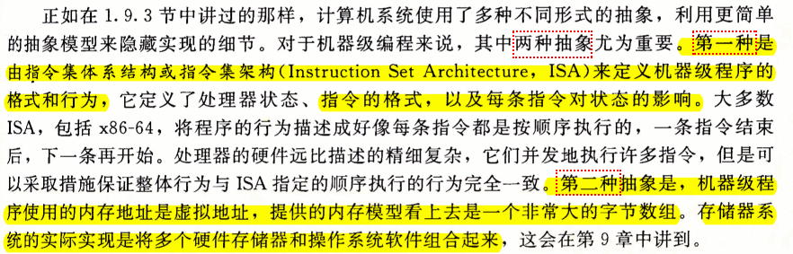
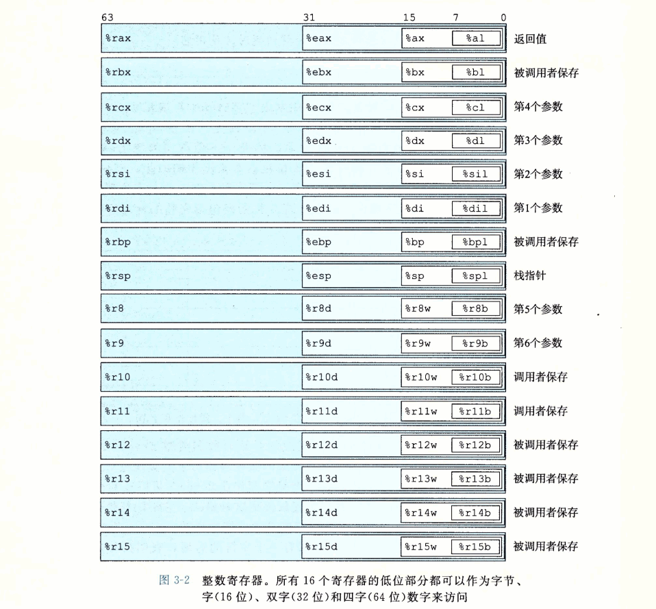
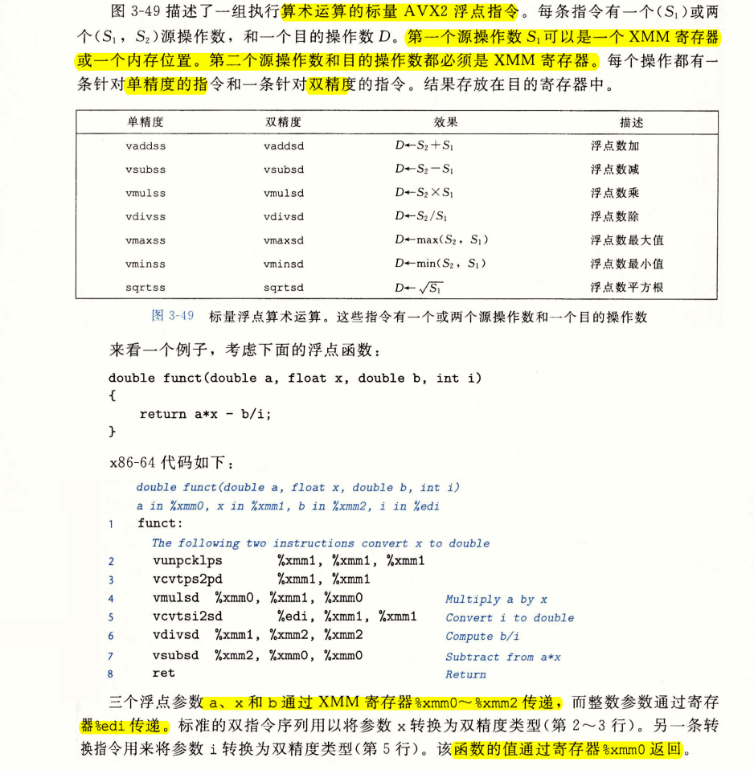

# Ch03 程序的机器级表示

## 3.1 历史观点


## 3.2 程序编码

### 3.2.1 机器级代码




- C语言提供一种模型，可以在内存中声明和分配各种数据类型的对象，但机器代码只是简单地将内存看成一个很大的、按字节寻址的数组。
  - 数组和结构：在机器代码中用一组连续的字节表示
  - 标量：汇编不区分有符号或无符号整数，不区分各种类型的指针，甚至不区分指针和整数。
- 程序内存包含（用虚拟地址来寻址）
  - 程序的可执行机器代码
  - 操作系统需要的一些信息
  - 管理过程调用和返回的运行时栈
  - 用户分配的内存块
- 操作系统负责管理虚拟地址空间，将虚拟地址翻译成实际处理器内存中的物理地址

```c
// 源代码
dongkesi@DESKTOP-CL29DN1:/mnt/d/workspace/study/COA/CSAPP/code$ cat mstore.c 
long mult2(long, long);

void multstore(long x, long y, long *dest) {
    long t = mult2(x, y);
    *dest = t;
}
```
```as
// 产生汇编代码
dongkesi@DESKTOP-CL29DN1:/mnt/d/workspace/study/COA/CSAPP/code$ gcc -Og -S mstore.c
```
```as
// 查看汇编
dongkesi@DESKTOP-CL29DN1:/mnt/d/workspace/study/COA/CSAPP/code$ cat mstore.s
        .file   "mstore.c"
        .text
        .globl  multstore
        .type   multstore, @function
multstore:
.LFB0:
        .cfi_startproc
        pushq   %rbx
        .cfi_def_cfa_offset 16
        .cfi_offset 3, -16
        movq    %rdx, %rbx
        call    mult2@PLT
        movq    %rax, (%rbx)
        popq    %rbx
        .cfi_def_cfa_offset 8
        ret
        .cfi_endproc
.LFE0:
        .size   multstore, .-multstore
        .ident  "GCC: (Ubuntu 7.4.0-1ubuntu1~18.04.1) 7.4.0"
        .section        .note.GNU-stack,"",@progbits
```
```as
// 编译并汇编
dongkesi@DESKTOP-CL29DN1:/mnt/d/workspace/study/COA/CSAPP/code$ gcc -Og -c mstore.c

// 查看代码段
dongkesi@DESKTOP-CL29DN1:/mnt/d/workspace/study/COA/CSAPP/code$ readelf -x .text mstore.o

Hex dump of section '.text':
 NOTE: This section has relocations against it, but these have NOT been applied to this dump.
  0x00000000 534889d3 e8000000 00488903 5bc3     SH.......H..[.
```


```as
dongkesi@DESKTOP-CL29DN1:/mnt/d/workspace/study/COA/CSAPP/code$ gdb mstore.o
GNU gdb (Ubuntu 8.1-0ubuntu3) 8.1.0.20180409-git
Copyright (C) 2018 Free Software Foundation, Inc.
License GPLv3+: GNU GPL version 3 or later <http://gnu.org/licenses/gpl.html>     
This is free software: you are free to change and redistribute it.
There is NO WARRANTY, to the extent permitted by law.  Type "show copying"
and "show warranty" for details.
This GDB was configured as "x86_64-linux-gnu".
Type "show configuration" for configuration details.
For bug reporting instructions, please see:
<http://www.gnu.org/software/gdb/bugs/>.
Find the GDB manual and other documentation resources online at:
<http://www.gnu.org/software/gdb/documentation/>.
For help, type "help".
Type "apropos word" to search for commands related to "word"...
Reading symbols from mstore.o...(no debugging symbols found)...done.
(gdb) x/14xb multstore
0x0 <multstore>:        0x53    0x48    0x89    0xd3    0xe8    0x00    0x00    0x00
0x8 <multstore+8>:      0x00    0x48    0x89    0x03    0x5b    0xc3
(gdb)

```

- 查看反汇编文件

```as
dongkesi@DESKTOP-CL29DN1:/mnt/d/workspace/study/COA/CSAPP/code$ objdump -d mstore.o 

mstore.o:     file format elf64-x86-64


Disassembly of section .text:

0000000000000000 <multstore>:
   0:   53                      push   %rbx
   1:   48 89 d3                mov    %rdx,%rbx
   4:   e8 00 00 00 00          callq  9 <multstore+0x9>
   9:   48 89 03                mov    %rax,(%rbx)
   c:   5b                      pop    %rbx
   d:   c3                      retq
```


```c
#include <stdio.h>

void multstore(long, long, long *);

int main() {
    long d;
    multstore(2, 3, &d);
    printf("2 * 3 --> %ld\n", d);
    return 0;
}

long mult2(long a, long b) {
    long s  = a * b;
    return s;
}
```

```
// 编译
dongkesi@DESKTOP-CL29DN1:/mnt/d/workspace/study/COA/CSAPP/code/3-2$ gcc -Og -o prog main.c mstore.c
```

```as
0000000000000741 <multstore>:
 741:   53                      push   %rbx
 742:   48 89 d3                mov    %rdx,%rbx
 745:   e8 ef ff ff ff          callq  739 <mult2> // 有了绝对地址，链接器填上的。
 74a:   48 89 03                mov    %rax,(%rbx)
 74d:   5b                      pop    %rbx
 74e:   c3                      retq
 74f:   90                      nop // 对齐到16字节，使得就存储系统性能而言，能更好地放置下一个代码块
```

- 完整的反汇编内容，多了很多代码。包含用来启动和终止程序的代码，以及用来与操作系统交互的代码

```as
dongkesi@DESKTOP-CL29DN1:/mnt/d/workspace/study/COA/CSAPP/code/3-2$ objdump -d prog 

prog:     file format elf64-x86-64


Disassembly of section .init:

0000000000000570 <_init>:
 570:   48 83 ec 08             sub    $0x8,%rsp
 574:   48 8b 05 6d 0a 20 00    mov    0x200a6d(%rip),%rax        # 200fe8 <__gmon_start__>
 57b:   48 85 c0                test   %rax,%rax
 57e:   74 02                   je     582 <_init+0x12>
 580:   ff d0                   callq  *%rax
 582:   48 83 c4 08             add    $0x8,%rsp
 586:   c3                      retq

Disassembly of section .plt:

0000000000000590 <.plt>:
 590:   ff 35 22 0a 20 00       pushq  0x200a22(%rip)        # 200fb8 <_GLOBAL_OFFSET_TABLE_+0x8>
 596:   ff 25 24 0a 20 00       jmpq   *0x200a24(%rip)        # 200fc0 <_GLOBAL_OFFSET_TABLE_+0x10>
 59c:   0f 1f 40 00             nopl   0x0(%rax)

00000000000005a0 <__stack_chk_fail@plt>:
 5a0:   ff 25 22 0a 20 00       jmpq   *0x200a22(%rip)        # 200fc8 <__stack_chk_fail@GLIBC_2.4>
 5a6:   68 00 00 00 00          pushq  $0x0
 5ab:   e9 e0 ff ff ff          jmpq   590 <.plt>

00000000000005b0 <__printf_chk@plt>:
 5b0:   ff 25 1a 0a 20 00       jmpq   *0x200a1a(%rip)        # 200fd0 <__printf_chk@GLIBC_2.3.4>
 5b6:   68 01 00 00 00          pushq  $0x1
 5bb:   e9 d0 ff ff ff          jmpq   590 <.plt>

Disassembly of section .plt.got:

00000000000005c0 <__cxa_finalize@plt>:
 5c0:   ff 25 32 0a 20 00       jmpq   *0x200a32(%rip)        # 200ff8 <__cxa_finalize@GLIBC_2.2.5>
 5c6:   66 90                   xchg   %ax,%ax

Disassembly of section .text:

00000000000005d0 <_start>:
 5d0:   31 ed                   xor    %ebp,%ebp
 5d2:   49 89 d1                mov    %rdx,%r9
 5d5:   5e                      pop    %rsi
 5d6:   48 89 e2                mov    %rsp,%rdx
 5d9:   48 83 e4 f0             and    $0xfffffffffffffff0,%rsp
 5dd:   50                      push   %rax
 5de:   54                      push   %rsp
 5df:   4c 8d 05 da 01 00 00    lea    0x1da(%rip),%r8        # 7c0 <__libc_csu_fini>
 5e6:   48 8d 0d 63 01 00 00    lea    0x163(%rip),%rcx        # 750 <__libc_csu_init>
 5ed:   48 8d 3d e6 00 00 00    lea    0xe6(%rip),%rdi        # 6da <main>        
 5f4:   ff 15 e6 09 20 00       callq  *0x2009e6(%rip)        # 200fe0 <__libc_start_main@GLIBC_2.2.5>
 5fa:   f4                      hlt
 5fb:   0f 1f 44 00 00          nopl   0x0(%rax,%rax,1)

0000000000000600 <deregister_tm_clones>:
 600:   48 8d 3d 09 0a 20 00    lea    0x200a09(%rip),%rdi        # 201010 <__TMC_END__>
 607:   55                      push   %rbp
 608:   48 8d 05 01 0a 20 00    lea    0x200a01(%rip),%rax        # 201010 <__TMC_END__>
 60f:   48 39 f8                cmp    %rdi,%rax
 612:   48 89 e5                mov    %rsp,%rbp
 615:   74 19                   je     630 <deregister_tm_clones+0x30>
 617:   48 8b 05 ba 09 20 00    mov    0x2009ba(%rip),%rax        # 200fd8 <_ITM_deregisterTMCloneTable>
 61e:   48 85 c0                test   %rax,%rax
 621:   74 0d                   je     630 <deregister_tm_clones+0x30>
 623:   5d                      pop    %rbp
 624:   ff e0                   jmpq   *%rax
 626:   66 2e 0f 1f 84 00 00    nopw   %cs:0x0(%rax,%rax,1)
 62d:   00 00 00
 630:   5d                      pop    %rbp
 631:   c3                      retq
 632:   0f 1f 40 00             nopl   0x0(%rax)
 636:   66 2e 0f 1f 84 00 00    nopw   %cs:0x0(%rax,%rax,1)
 63d:   00 00 00

0000000000000640 <register_tm_clones>:
 640:   48 8d 3d c9 09 20 00    lea    0x2009c9(%rip),%rdi        # 201010 <__TMC_END__>
 647:   48 8d 35 c2 09 20 00    lea    0x2009c2(%rip),%rsi        # 201010 <__TMC_END__>
 64e:   55                      push   %rbp
 64f:   48 29 fe                sub    %rdi,%rsi
 652:   48 89 e5                mov    %rsp,%rbp
 655:   48 c1 fe 03             sar    $0x3,%rsi
 659:   48 89 f0                mov    %rsi,%rax
 65c:   48 c1 e8 3f             shr    $0x3f,%rax
 660:   48 01 c6                add    %rax,%rsi
 663:   48 d1 fe                sar    %rsi
 666:   74 18                   je     680 <register_tm_clones+0x40>
 668:   48 8b 05 81 09 20 00    mov    0x200981(%rip),%rax        # 200ff0 <_ITM_registerTMCloneTable>
 66f:   48 85 c0                test   %rax,%rax
 672:   74 0c                   je     680 <register_tm_clones+0x40>
 674:   5d                      pop    %rbp
 675:   ff e0                   jmpq   *%rax
 677:   66 0f 1f 84 00 00 00    nopw   0x0(%rax,%rax,1)
 67e:   00 00
 680:   5d                      pop    %rbp
 681:   c3                      retq
 682:   0f 1f 40 00             nopl   0x0(%rax)
 686:   66 2e 0f 1f 84 00 00    nopw   %cs:0x0(%rax,%rax,1)
 68d:   00 00 00

0000000000000690 <__do_global_dtors_aux>:
 690:   80 3d 79 09 20 00 00    cmpb   $0x0,0x200979(%rip)        # 201010 <__TMC_END__>
 697:   75 2f                   jne    6c8 <__do_global_dtors_aux+0x38>
 699:   48 83 3d 57 09 20 00    cmpq   $0x0,0x200957(%rip)        # 200ff8 <__cxa_finalize@GLIBC_2.2.5>
 6a0:   00
 6a1:   55                      push   %rbp
 6a2:   48 89 e5                mov    %rsp,%rbp
 6a5:   74 0c                   je     6b3 <__do_global_dtors_aux+0x23>
 6a7:   48 8b 3d 5a 09 20 00    mov    0x20095a(%rip),%rdi        # 201008 <__dso_handle>
 6ae:   e8 0d ff ff ff          callq  5c0 <__cxa_finalize@plt>
 6b3:   e8 48 ff ff ff          callq  600 <deregister_tm_clones>
 6b8:   c6 05 51 09 20 00 01    movb   $0x1,0x200951(%rip)        # 201010 <__TMC_END__>
 6bf:   5d                      pop    %rbp
 6c0:   c3                      retq
 6c1:   0f 1f 80 00 00 00 00    nopl   0x0(%rax)
 6c8:   f3 c3                   repz retq
 6ca:   66 0f 1f 44 00 00       nopw   0x0(%rax,%rax,1)

00000000000006d0 <frame_dummy>:
 6d0:   55                      push   %rbp
 6d1:   48 89 e5                mov    %rsp,%rbp
 6d4:   5d                      pop    %rbp
 6d5:   e9 66 ff ff ff          jmpq   640 <register_tm_clones>

00000000000006da <main>:
 6da:   48 83 ec 18             sub    $0x18,%rsp
 6de:   64 48 8b 04 25 28 00    mov    %fs:0x28,%rax
 6e5:   00 00
 6e7:   48 89 44 24 08          mov    %rax,0x8(%rsp)
 6ec:   31 c0                   xor    %eax,%eax
 6ee:   48 89 e2                mov    %rsp,%rdx
 6f1:   be 03 00 00 00          mov    $0x3,%esi
 6f6:   bf 02 00 00 00          mov    $0x2,%edi
 6fb:   e8 41 00 00 00          callq  741 <multstore>
 700:   48 8b 14 24             mov    (%rsp),%rdx
 704:   48 8d 35 c9 00 00 00    lea    0xc9(%rip),%rsi        # 7d4 <_IO_stdin_used+0x4>
 70b:   bf 01 00 00 00          mov    $0x1,%edi
 710:   b8 00 00 00 00          mov    $0x0,%eax
 715:   e8 96 fe ff ff          callq  5b0 <__printf_chk@plt>
 71a:   48 8b 4c 24 08          mov    0x8(%rsp),%rcx
 71f:   64 48 33 0c 25 28 00    xor    %fs:0x28,%rcx
 726:   00 00
 728:   75 0a                   jne    734 <main+0x5a>
 72a:   b8 00 00 00 00          mov    $0x0,%eax
 72f:   48 83 c4 18             add    $0x18,%rsp
 733:   c3                      retq
 734:   e8 67 fe ff ff          callq  5a0 <__stack_chk_fail@plt>

0000000000000739 <mult2>:
 739:   48 89 f8                mov    %rdi,%rax
 73c:   48 0f af c6             imul   %rsi,%rax
 740:   c3                      retq

0000000000000741 <multstore>:
 741:   53                      push   %rbx
 742:   48 89 d3                mov    %rdx,%rbx
 745:   e8 ef ff ff ff          callq  739 <mult2>
 74a:   48 89 03                mov    %rax,(%rbx)
 74d:   5b                      pop    %rbx
 74e:   c3                      retq
 74f:   90                      nop

0000000000000750 <__libc_csu_init>:
 750:   41 57                   push   %r15
 752:   41 56                   push   %r14
 754:   49 89 d7                mov    %rdx,%r15
 757:   41 55                   push   %r13
 759:   41 54                   push   %r12
 75b:   4c 8d 25 4e 06 20 00    lea    0x20064e(%rip),%r12        # 200db0 <__frame_dummy_init_array_entry>
 762:   55                      push   %rbp
 763:   48 8d 2d 4e 06 20 00    lea    0x20064e(%rip),%rbp        # 200db8 <__init_array_end>
 76a:   53                      push   %rbx
 76b:   41 89 fd                mov    %edi,%r13d
 76e:   49 89 f6                mov    %rsi,%r14
 771:   4c 29 e5                sub    %r12,%rbp
 774:   48 83 ec 08             sub    $0x8,%rsp
 778:   48 c1 fd 03             sar    $0x3,%rbp
 77c:   e8 ef fd ff ff          callq  570 <_init>
 781:   48 85 ed                test   %rbp,%rbp
 784:   74 20                   je     7a6 <__libc_csu_init+0x56>
 786:   31 db                   xor    %ebx,%ebx
 788:   0f 1f 84 00 00 00 00    nopl   0x0(%rax,%rax,1)
 78f:   00
 790:   4c 89 fa                mov    %r15,%rdx
 793:   4c 89 f6                mov    %r14,%rsi
 796:   44 89 ef                mov    %r13d,%edi
 799:   41 ff 14 dc             callq  *(%r12,%rbx,8)
 79d:   48 83 c3 01             add    $0x1,%rbx
 7a1:   48 39 dd                cmp    %rbx,%rbp
 7a4:   75 ea                   jne    790 <__libc_csu_init+0x40>
 7a6:   48 83 c4 08             add    $0x8,%rsp
 7aa:   5b                      pop    %rbx
 7ab:   5d                      pop    %rbp
 7ac:   41 5c                   pop    %r12
 7ae:   41 5d                   pop    %r13
 7b0:   41 5e                   pop    %r14
 7b2:   41 5f                   pop    %r15
 7b4:   c3                      retq   
 7b5:   90                      nop
 7b6:   66 2e 0f 1f 84 00 00    nopw   %cs:0x0(%rax,%rax,1)
 7bd:   00 00 00

00000000000007c0 <__libc_csu_fini>:
 7c0:   f3 c3                   repz retq

Disassembly of section .fini:

00000000000007c4 <_fini>:
 7c4:   48 83 ec 08             sub    $0x8,%rsp
 7c8:   48 83 c4 08             add    $0x8,%rsp
 7cc:   c3                      retq
```

### 3.2.3 关于格式的注解


## 3.3 数据格式


## 3.4 访问信息




### 3.4.1 操作数指示符


### 3.4.2 数据传送指令


- 注意MOVZ与MOVS使用寄存器或内存地址作为源， 以寄存器作为目的。

### 3.4.3 数据传送示例

- 当执行强制类型转换既涉及大小变化又涉及C语言中符号变化时，操作应该先改变大小。

### 3.4.4 压入和弹出栈数据


## 3.5 算术和逻辑操作


### 3.5.1 加载有效地址

- movq的变形。不引用内存，只计算地址


### 3.5.2 一元和二元操作

- 一元操作：操作数可以是寄存器/内存地址。操作数既是源又是目的。对应C语言中的++/--
- 二元操作：第二个操作数既是源又是目的；对应C语言中的 +=、-=、*=之类
  - 第一个操作数可以是立即数、寄存器、内存位置
  - 第二个操作数可以是寄存器或是内存
  - 当第二个操作数为内存地址时，处理器必须从内存读出值，执行操作，再把结果写回内存。

### 3.5.3 移位操作

- 操作数：
  - 移位量：立即数，或者单字节%cl中。
    - 移位操作对w位长的数据值进行操作，移位量是由%cl寄存器的低m为决定的，这里$2^m=w$。高位会被忽略。例如：当%cl=0xFF时：
      - salb：使用低3位，其余忽略，移7位
      - salw：使用低4位，其余忽略，移15位
      - sall：使用低5位，其余忽略，移31位
      - salq：使用低6位，其余忽略，移63位
  - 目的操作数：寄存器、内存位置

### 3.5.4 讨论

- 大多数算术指令，既可用于无符号运算，也可以用于补码运算。**只有右移操作需要区分有符号和无符号数。这个特性使得补码运算成为实现有符号整数运算的一种比较好的方法的原因之一**。

### 3.5.5 特殊的算术操作


```c
#include <inttypes.h>

typedef unsigned __int128 uint128_t;

void store_uprod(uint128_t *dest, uint64_t x, uint64_t y) {
    *dest = x * (uint128_t) y;
}
```
```asm
        .file   "t3-1.c"
        .text
        .globl  store_uprod
        .type   store_uprod, @function
store_uprod:
.LFB4:
        .cfi_startproc
        movq    %rsi, %rax
        mulq    %rdx
        movq    %rax, (%rdi)
        movq    %rdx, 8(%rdi)
        ret
        .cfi_endproc
.LFE4:
        .size   store_uprod, .-store_uprod
        .ident  "GCC: (Ubuntu 7.4.0-1ubuntu1~18.04.1) 7.4.0"
        .section        .note.GNU-stack,"",@progbits
```

```c
void remdiv(long x, long y, long *qp, long *rp) {
    long q = x / y;
    long r = x % y;
    *qp = q;
    *rp = r;
}
```

```asm
        .file   "t3-2.c"
        .text
        .globl  remdiv
        .type   remdiv, @function
remdiv:
.LFB0:
        .cfi_startproc
        movq    %rdi, %rax
        movq    %rdx, %rdi
        cqto
        idivq   %rsi
        movq    %rax, (%rdi)
        movq    %rdx, (%rcx)
        ret
        .cfi_endproc
.LFE0:
        .size   remdiv, .-remdiv
        .ident  "GCC: (Ubuntu 7.4.0-1ubuntu1~18.04.1) 7.4.0"
        .section        .note.GNU-stack,"",@progbits
```

## 3.6 控制

- 机器代码提供两种基本的低级机制来实现有条件的行为：测试数据值，然后根据测试的结果来改变控制流或者数据流

### 3.6.1 条件码

- leaq指令不改变任何条件码，因为它是用来进行地址计算的。


### 3.6.2 访问条件码

- 条件码通常不会直接读取，常用的使用方法有三种：
  - 可以根据条件码的某种组合，将一个字节设置为0或者1
    - 这一整类指令称为SET指令；SET指令的目的操作数是低位单字节寄存器元素之一，或是一个字节的内存位置，指令会将这个字节设置成0或者1。为了得到一个32、64位的结果，我们必须对高位清零。
  - 可以条件跳转到程序的某个其它的部分
  - 可以有条件第传送数据
- **汇编代码不会记录程序值的类型。相反地，不同的指令确定操作数的大小以及是有符号的还是无符号的。** 通过汇编代码，推测C代码的数据类型，是需要做的。

  


- 机器代码如何区分无符号和有符号值？
  - 同C语言不同，机器代码不会将每个程序值都和一个数据类型联系起来。
  - 相反，大多数情况下，机器代码对于有符号和无符号两种情况都使用一样的指令，这是因为许多算术运算对无符号和补码运算都有一样的位级行为。
  - 有些情况需要用不同的指令来处理有符号和无符号操作，例如，使用不同版本的右移、除法和乘法指令，以及不同的条件码组合。


### 3.6.3 跳转指令


### 3.6.4 跳转指令的编码

- 在汇编代码中，跳转目标用符号标号书写。
- 跳转指令有两种编码：
  - PC相对寻址：将目标指令的地址与紧跟在跳转指令后面那条指令的地址（早期处理器的实现，会将更新程序计数器作为执行一条指令的第一步）之间的差作为编码；这些地址偏移量可以编码为1、2、4字节
  - 绝对地址：用4个字节直接指定目标

  汇编器和链接器会选择适当的跳转目的编码


### 3.6.5 用条件控制来实现条件分支

- 将条件表达式和语句从C语言翻译成机器代码，最常用的方式是结合有条件和无条件跳转。
  - 另一种方式，有些条件可以**用数据的条件转移**实现，而不是**用控制的条件转移**来实现。


```c
long lt_cnt = 0;
long ge_cnt = 0;

long absdiff_se(long x, long y) {
    long result;
    if (x < y) {
        lt_cnt++;
        result = y - x;
    } else {
        ge_cnt++;
        result = x - y;
    }
    return result;
}
```

```asm
        .file   "t1.c"
        .text
        .globl  absdiff_se
        .type   absdiff_se, @function
absdiff_se:
.LFB0:
        .cfi_startproc
        cmpq    %rsi, %rdi
        jl      .L4
        addq    $1, ge_cnt(%rip)
        movq    %rdi, %rax
        subq    %rsi, %rax
        ret
.L4:
        addq    $1, lt_cnt(%rip)
        movq    %rsi, %rax
        subq    %rdi, %rax
        ret
        .cfi_endproc
.LFE0:
        .size   absdiff_se, .-absdiff_se
        .globl  ge_cnt
        .bss
        .align 8
        .type   ge_cnt, @object
        .size   ge_cnt, 8
ge_cnt:
        .zero   8
        .globl  lt_cnt
        .align 8
        .type   lt_cnt, @object
        .size   lt_cnt, 8
lt_cnt:
        .zero   8
        .ident  "GCC: (Ubuntu 7.4.0-1ubuntu1~18.04.1) 7.4.0"
        .section        .note.GNU-stack,"",@progbits
```
### 3.6.6 用条件传送来实现条件分支

- **条件控制**在现代处理器上非常低效。一种替代的策略是使用**数据的条件转移**。
  - 数据条件：计算一个条件操作的两种结果，然后再根据条件是否满足从中选取一个。
    - 使用比较受限制，如果可行，使用一条简单的条件传送指令就可以实现。
    - 条件传送更符合现代处理器的性能特性


- 为什么数据传送比基于条件控制转移的代码性能好？

  


- 条件传送指令
  - 只能用于非常受限制的情况；
    - 并不总是提高代码的效率。比如then-expr和else-expr的求值需要大量的计算，那么当相应的条件不满足时，工作就白费了。
    - 编译器必须考虑浪费的计算和由于分支预测错误所造成的性能处罚之间的相对性能。
  - 操作数：
    - 源：寄存器、内存地址
    - 目的：寄存器
  - 源值可以从内存或者源寄存器中读取，但是只有在指定的条件满足时，才会被赋值到目的寄存器。
  - 源和目的可以是16、32、64；不支持单字节的条件传送
    - 编译器从目标寄存器的名字推断操作数长度。


### 3.6.7 循环


### 3.6.8 switch语句

- switch一般通过使用跳转表实现。
  - 跳转表：是一个数组，表项`i`是一个代码段的地址，这个代码段实现当switch索引值等于`i`时程序应该采取的动作。
  - 优点：执行switch语句的时间与switch case的数量无关
  - GCC根据开关情况的数量和开关情况值的稀疏程度来翻译开关语句。当开关情况比较多，并且值的范围跨度比较小时，就会使用跳转表。


## 3.7 过程


### 3.7.1 运行时栈

- 通过寄存器，过程P可以传递最多6个整数值，但是如果Q需要更多的参数，P可以在调用P之前在自己的栈帧里存储好这些参数。
- 为了提高空间和时间效率，x86-64过程只分配自己所需要的栈帧的部分


### 3.7.2 转移控制


### 3.7.3 数据传送


### 3.7.4 栈上的局部存储


### 3.7.5 寄存器中的局部存储空间

- 寄存器组是唯一被所有过程共享的资源。
- 寄存器`%rbx`、`%rbp`和`%r12~r15`划分为**被调用者保存寄存器**。当过程P调用过程Q时，Q必须保存这些寄存器的值，保证它们的值在Q返回到P时与Q被调用时是一样的。
- 所有其它的寄存器，除了栈指针`%rsp`，都分类为**调用者保存寄存器**。

### 3.7.6 递归过程


## 3.8 数组分配和访问

- C语言中的数组是一种将标量数据聚集成更大数据类型的方式。C语言的一个不同寻常的特点是可以产生指向数组中元素的指针。

### 3.8.1 基本原则


### 3.8.2 指针运算


### 3.8.3 嵌套的数组


### 3.8.4 定长数组


### 3.8.5 变长数组


## 3.9 异质的数据结构

### 3.9.1 结构


### 3.9.2 联合

- 联合提供了一种方式，能够规避C语言的类型系统，允许以多种类型来引用一个对象。
- 一个联合的总的大小等于它最大字段的大小
- 应用情况：如果事先知道对一个数据结构中的两个不同字段的使用是互斥的，那么将这两个字段声明为联合的一部分，而不是结构的一部分，会减小分配空间的总量。
- 用联合来将各种不同大小的数据类型结合到一起时，字节顺序问题变得很重要。

### 3.9.3 数据对齐


## 3.10 在机器级程序中将控制和数据联合起来

### 3.10.1 理解指针


### 3.10.2 应用：使用GDB调试器

### 3.10.3 内存越界引用和缓冲区溢出


### 3.10.4 对抗缓冲区溢出攻击


### 3.10.5 支持变长栈帧


## 3.11 浮点代码


- SIMD: 
  - 名字的修改：MMX -> SSE -> AVX -> AVX2
  - 寄存器名字: MM  -> XMM -> YMM -> YMM
- x86-64浮点数基于SSE或AVX，包括传递过程参数和返回值的规则
- 当对标量数据操作时，下面这些寄存器只保存浮点数，而且只使用低32位(float)或64位(double)
  


### 3.11.1 浮点传送和转换操作


### 3.11.2 过程中的浮点代码


### 3.11.3 浮点运算操作



### 3.11.4 定义和使用浮点常数


### 3.11.5 在浮点代码中使用位级操作


### 3.11.6 浮点比较操作


### 3.11.7 对浮点代码的观察结论


## 3.12 小结