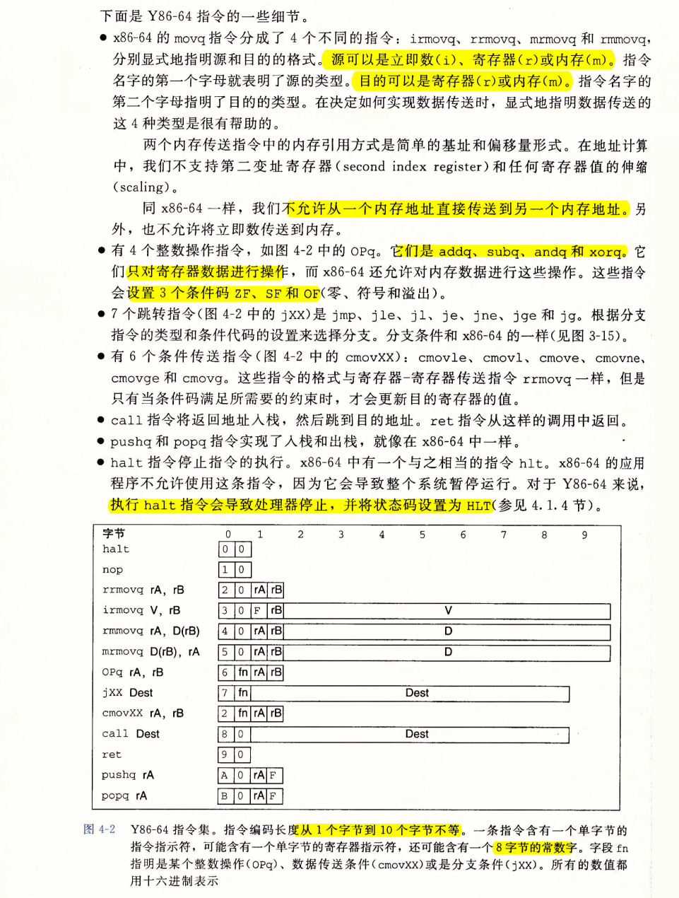
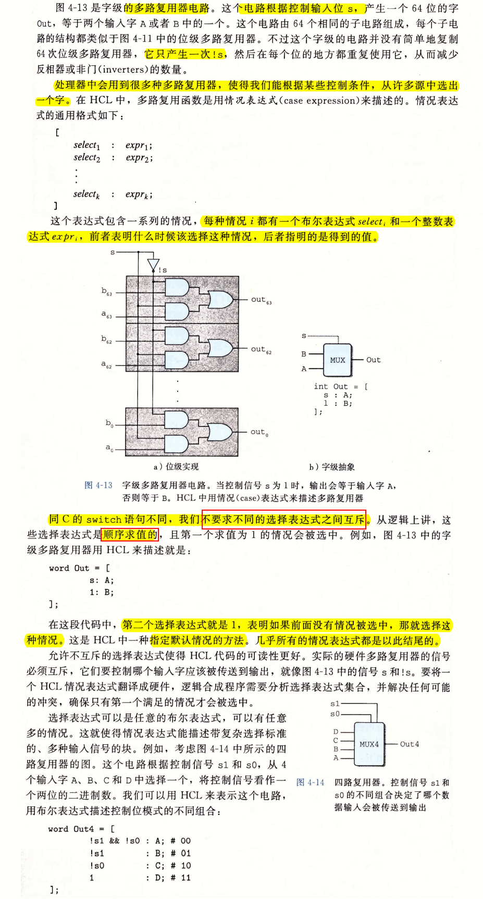
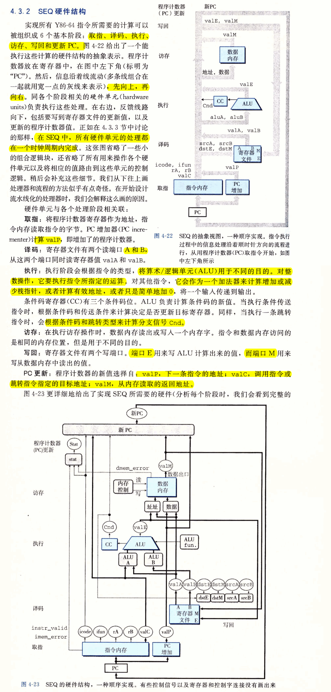

# Ch04 处理器体系结构
- 一个处理器支持的指令和指令的字节级编码成为它的指令体系结构(ISA)
- ISA在编译器编写者和处理器设计人员之间提供了一个概念抽象层，编译器编写者只需要直到允许哪些指令，以及它们是如何编码的；而处理器设计者必须建造出执行这些指令的处理器。
- 冒险或冲突(hazard)：一条指令的位置或操作数依赖于其它仍在流水线中的指令。

## 4.1 Y86-64指令集体系结构
- 定义一个指令集体系结构包括定义
  - 各种状态单元
  - 指令集和它们的编码
  - 一组编程规范
  - 异常事件处理
### 4.1.1 程序员可见的状态


### 4.1.2 Y86-64 指令



### 4.1.3 指令编码


### 4.1.4 Y86-64 异常


### 4.1.5 Y86-64 程序


- e4-4
  ```c                     
  dongkesi@DESKTOP-CL29DN1:/mnt/d/workspace/study/COA/CSAPP/code$ cat t4-4.c 
  long rsum(long *start, long count)
  {
      if (count <= 0)
          return 0;
      return *start + rsum(start+1, count-1);       
  }
  ```
  ```bash
  dongkesi@DESKTOP-CL29DN1:/mnt/d/workspace/study/COA/CSAPP/code$PP/code$ gcc -S -Og t4-4.c   
  ```
  ```s
  dongkesi@DESKTOP-CL29DN1:/mnt/d/workspace/study/COA/CSAPP/code$ cat t4-4.s
          .file   "t4-4.c"
          .text
          .globl  rsum
          .type   rsum, @function
  rsum:
  .LFB0:
          .cfi_startproc
          testq   %rsi, %rsi
          jg      .L8
          movl    $0, %eax
          ret
  .L8:
          pushq   %rbx
          .cfi_def_cfa_offset 16
          .cfi_offset 3, -16
          movq    (%rdi), %rbx
          subq    $1, %rsi
          addq    $8, %rdi
          call    rsum
          addq    %rbx, %rax
          popq    %rbx
          .cfi_def_cfa_offset 8
          ret
          .cfi_endproc
  .LFE0:
          .size   rsum, .-rsum
          .ident  "GCC: (Ubuntu 7.4.0-1ubuntu1~18.04.1) 7.4.0"
  ```

### 4.1.6 一些 Y86-64 指令的详情


## 4.2 逻辑设计和硬件控制语言 HCL

- 要实现一个数字系统需要三个主要的组成部分：
  - 计算对位进行操作的函数的组合逻辑
  - 存储位的存储器单元
  - 控制存储器单元更新的时钟信号

### 4.2.1 逻辑门


### 4.2.1 组合电路和 HCL 布尔表达式


### 4.2.3 字级的组合电路和 HCL 整数表达式





### 4.2.4 集合关系


### 4.2.5 存储器和时钟


## 4.3 Y86-64 的顺序实现

- SEQ: 顺序处理器，每个时钟周期上，SEQ执行处理一条完整指令所需的所有步骤。
- 时钟周期会低的不可接受。
  
### 4.3.1 将处理组织成阶段
- 取指(fetch)->译码(decode)->执行(execute)->访存(memory)->写回(write back)->更新(PC update)


### 4.3.2 SEQ 硬件结构




### 4.3.3 SEQ 的时序

- 一个时钟变化会引发一个经过组合逻辑的流，来执行整个指令
  


### 4.3.4 SEQ 阶段的实现


## 4.4 流水线的通用原理


### 4.4.1 计算流水线


### 4.4.2 流水线操作的详细说明


### 4.4.3 流水线的局限性

- 影响流水线效率的因素：
  - 不一致的划分：运行时钟的速率由最慢的阶段的延迟限制。
  - 流水线过深，收益反而下降：流水线寄存器延迟成为制约因素


### 4.4.4 带反馈的流水线系统


## 4.5 Y86-64 的流水线实现

- 首先，对顺序SEQ做一点改动，将PC的计算挪到取值阶段。

### 4.5.1 SEQ+：重新安排计算阶段


### 4.5.2 插入流水线寄存器


### 4.5.3 对信号进行重新排列和标号

### 4.5.4 预测下一个PC

### 4.5.5 流水线冒险


### 4.5.6 异常处理
- 在一个流水线化的系统中，异常处理包括一些细节问题：
  - 首先，可能同时有多条指令引起异常
    - 由流水线中最深的指令引起的异常，优先级最高
  - 第二个细节问题是，当首先取出一条指令，开始执行时，导致了一个异常，而后来由于分支预测错误，取消了该指令。
  - 第三细节问题的产生是因为流水线化的处理器会在不同的阶段更新系统状态的不同部分。

### 4.5.7 PIPE 各阶段的实现

### 4.5.8 流水线控制逻辑

### 4.5.9 性能分析


### 4.5.10 未完成的工作


## 4.6 小结