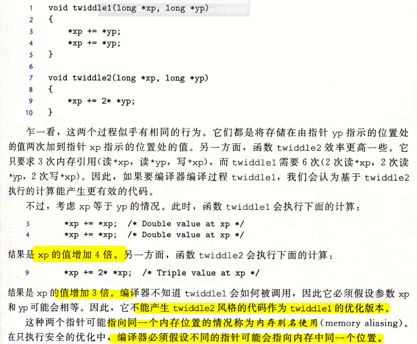
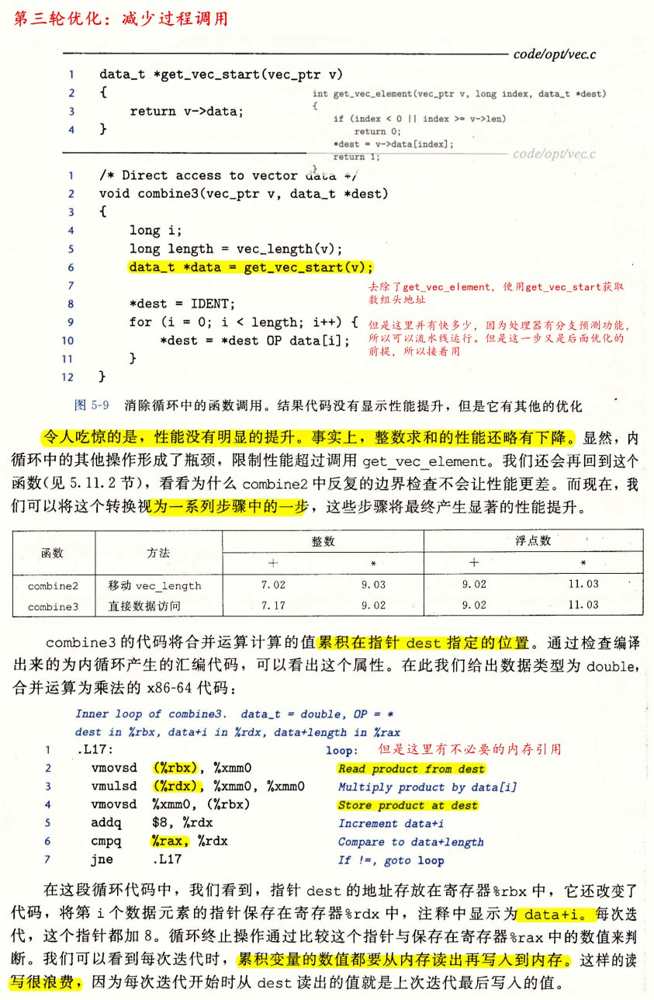
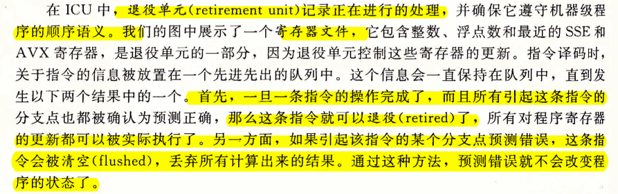

# Ch05 优化程序性能

- 编写高效程序需要做到以下几点：
  - 第一，必须选择一组适当的算法和数据结构
  - 第二，必须编写出编译器能够有效优化以转换成高效可执行代码的源代码
    - 理解优化编译器的能力和局限性是很重要的。
      > C语言的有些特性，例如执行指针运算和强制类型转换的能力，使得编译器很难对它进行优化
  - 第三，针对处理运算量特别大的计算，将一个任务分成多个部分，这些部分可以在多核和多处理器的某种组合上并行地计算。
    > 第十二章介绍

- 即使最好的编译器也受到**妨碍优化的因素（optimization blocker）** 的阻碍，**妨碍优化的因素就是程序行为中那些严重依赖于执行环境的方面**。程序员必须编写容易优化的代码，以帮助编译器。

- 程序优化：
  - 第一步，消除不必要的工作，让代码尽可能有效地执行所期望的任务。
    - 包括消除不必要的函数调用、条件测试和内存引用。这些优化**不依赖于目标机器的任何具体属性**。
  - 第二步，利用处理器提供的指令级并行能力，同时执行多条指令。在此之前必须理解处理器如何工作。
    > 降低一个计算的不同部分之间的数据相关，增加并行度，就可以同时执行这些部分了。
- 代码剖析程序是测量程序各个部分性能的工具，这种分析能够帮助找到代码中低效率的地方，并且确定程序中我们应该着重优化的部分。
- 仔细研究内循环的代码时一个很好的开端，识别出降低性能的属性。通过确认关键路径来决定执行一个循环所需要的时间（或者说，至少是一个时间下界）。
  - 关键路径：在循环中反复执行过程中形成的**数据相关链**。
- 优化程度：代码修改的程度可以充分利用编译器产生有效优化代码就可以。
## 5.1 优化编译器的能力和局限性
- 有时候用-O3级别的优化不一定比-O1的优化更好。
- 编译器会小心地对程序只使用**安全的**优化。从而限制编译器。
  - 这也意味着程序员需花费力气写出编译器能将之转换成有效机器代码的程序。

- 妨碍优化的因素：
  - 编译器不能确定两个指针是否指向同一个位置，就必须假设什么情况都有可能，这就限制了可能的优化策略。

    

  - 函数调用。大多数编译器不会试图判断一个函数是否有无副作用，如果没有，就可能被优化成像func2中的样子。相反，编译器会假设最糟的情况，并保持所有的函数调用不变。

    

    

## 5.2 表示程序性能

- 用每元素的周期数，作为表示程序性能并指导我们改进代码的方法。

## 5.3 程序示例

- 合并函数：就是本章一直贯穿的combinex函数

- 最好的方法是实验加上分析：反复地尝试不同方法，进行测量，并检查汇编代码表示以确定低层的性能瓶颈。

- 第一轮优化：使用编译器优化参数

  

## 5.4 消除循环的低效率

- 移动代码：这类优化包括识别要执行多次（例如在循环里）但是计算结果不会改变的计算。因而可以**将计算移动到代码前面不会被多次求值的部分**。

## 5.5 减少过程调用

## 5.6 消除不必要的内存引用

## 5.7 理解现代处理器

- 以上几节讨论的优化都**不依赖于目标机器的任何特性**。这些优化只是简单地降低了过程调用的开销，以及消除了一些重大的“妨碍优化的因素”，**这些因素会给优化编译器造成困难**。
- 随着试图进一步提高性能，必须考虑利用处理器**微体系结构**的优化，也就是处理器用来执行指令的底层系统设计。
- 两种下界描述了程序的最大性能：
  - 当一系列操作必须按照**严格顺序执行**时，就会遇到**延迟界限**(latency bound)，因为在**下一条指令开始之前，这条指令必须结束**。当代码中的**数据相关**限制了处理器利用指令级并行的能力时，延迟界限会限制程序性能。
    - 有了数据相关限制指令并行->延迟界限就会限制程序性能。
  - 吞吐量界限（throughput bound）刻画了处理器功能单元的原始计算能力。这个界限是程序性能的**终极限制**。
- 现代微处理器取得的了不起的功绩之一是：它们采用复杂而奇异的微处理器结构，其中，**多条指令可以并行地执行，同时又呈现出一种简单的顺序执行指令的表象**。

### 5.7.1 整体操作

- 超标量：每个时钟周期执行多个操作
- 乱序：指令的顺序不一定要与它们在机器级程序中的顺序一致。
  - 乱序处理器需要更大、更复杂的硬件，但是它们能更好地达到更高的指令级并行度。
- 整体设计有两部分：
  - 指令控制单元：负责从内存中读出指令序列，并根据这些指令序列生成一组针对程序数据的基本操作；
  - 执行单元：执行这些操作。

  

- 现代处理器：
  - 分支预测技术：处理器猜测是否会选择分支，同时还预测分支的目标地址；
    - 标记为取指控制的块包括分支预测，以完成确定取哪些指令的任务。
  - 使用投机执行：处理器会开始取出位于它预测的分支会跳到的地方的指令，并对指令译码，甚至在它确定分支预测是否正确之前就开始执行这些操作。
  - 退役单元：记录正在进行的处理，并确保它遵守机器级程序的顺序语义。

    

  
- 关于指令如何被译码成操作序列的细节，不同的机器都会不同，这**个信息可谓是高度机密**。幸运的是，不需要知道某台机器实现的低层细节，我们也能优化自己的程序。
- `addq %rax, 8(%rdx)`: 会产生多个操作，把内存引用和算术运算分开：
  - 一个操作从内存中加载一个值到处理器中
  - 一个操作将加载进来的值加上寄存器%rax中的值
  - 一个操作将结果存回到内存
  - 这种译码逻辑对指令进行分解，允许任务在一组专门的硬件单元之间进行分割。
  - 这些单元可以并行地执行多条指令的不同部分。
  
### 5.7.2 功能单元的性能

- 很短的发射时间是通过使用流水线实现的。
- 流水线化的功能单元实现为一系列的阶段，每个阶段完成一部分的运算。  
- 一个典型的浮点加法器包含三个阶段，所以有三个周期的延迟。
  - 一个阶段处理指数值
  - 一个阶段将小数相加
  - 另一个阶段对结果进行舍入
- 发射时间为1的功能单元被称为**完全流水线化的**：每个时钟周期可以开始一个新的运算。
  - 除法器不是完全流水线化的——它的发射时间等于它的延迟。意味着在开始一条新运算之前，除法器必须完成整个除法。
- 出现容量大于1的运算是由于有多个功能单元。

- 吞吐量： C/I

### 5.7.3 处理器操作的抽象模型

- 关键路径：执行一组机器指令所需时钟周期数的一个下界

#### 1. 从机器级代码到数据流图

#### 2. 其它性能因素

## 5.8 循环展开

- 循环展开能够从两个方面改进程序的性能。
  - 首先，**减少了不直接有助于程序结果的操作的数量**，例如循环索引计算和条件分支
  - 第二，它提供了一些方法，可以进一步变化代码，**减少整个计算中关键路径上的操作数量**。

- 如何计算循环参数

  

## 5.9 提高并行性

### 5.9.1 多个累积变量

### 5.9.2 重新结合变换

## 5.10 优化合并代码的结果小结

## 5.11 一些限制因素

### 5.11.1 寄存器溢出

### 5.11.2 分支预测和预测错误处罚

- C语言程序员怎么能够保证分支预测处罚不会阻碍程序得效率呢？没有简单的答案，可用以下通用的原则
  - 不要过分关心可预测的分支；比如循环中，只有最后一次分支会预测错误。
  
    

  - 书写适合用条件传送实现的代码
  
    

## 5.12 理解内存性能

- 现代处理器有专门的功能单元来执行加载和存储操作，这些单元有**内部缓冲**区来保存未完成的内存操作请求集合。

### 5.12.1 加载的性能
- 一个包含加载操作的程序性能既依赖于流水线的能力，也依赖于加载单元的延迟。

### 5.12.2 存储的性能

- 对于寄存器操作，在指令被译码成操作的时候，处理器就可以确定哪些指令会影响其它哪些指令。对于内存操作，只有到计算出加载和存储的地址后，处理器才能确定哪些指令会影响其它的哪些。

## 5.13 应用：性能提高技术

## 5.14 确认和消除性能瓶颈

### 5.14.1 程序剖析

- GPROF工具
  
  

### 5.14.2 使用剖析程序来指导优化

- Amdahl定律

## 5.15 小结

- 应用程序员需要帮助编译器完成生成高效代码的任务。
  - 第一是算法
  - 第二去除妨碍优化的因素
  - 理解处理器微体系结构
  - 确认数据相关决定的关键路径
  - 使分支容易预测，或使它们容易用条件数据传送来实现
  - 存储和加载操作
  - 数据保存在局部变量中，可以放在寄存器中
  - 大型程序集中注意力在最耗时的部分